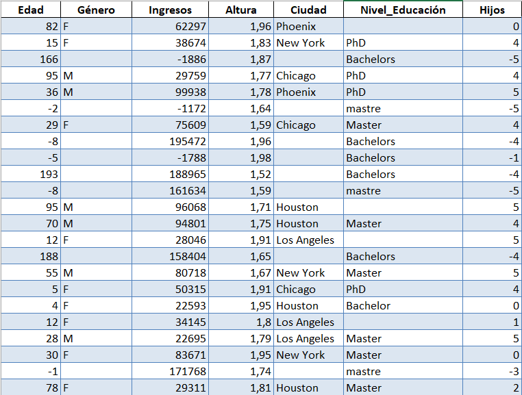
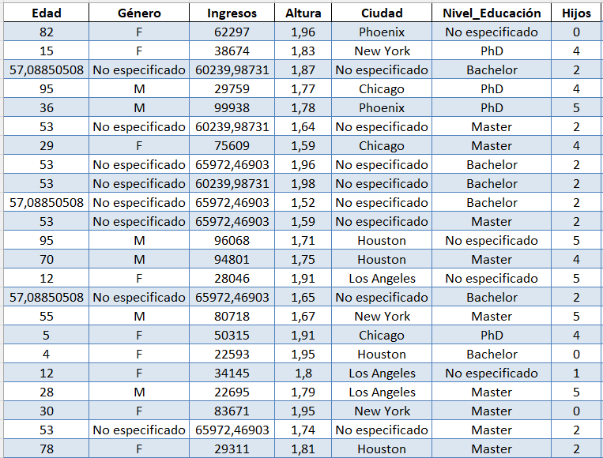

# Data Process

This project is designed to process and analyze data. It uses data processing tools and techniques to clean, transform, and extract meaningful information from data sets.

## Content

- **DataSets/**: Folder containing the datasets used in the project.
- **Process/**: Folder containing the functions and dictionaries to use, separated by .py files
- **Main.py**: File that executes all data processing
  
## Requisitos

To run the scripts in this project, make sure you have the following Python packages installed:

- pandas
- numpy

Puedes instalar estos paquetes utilizando pip:

```bash
pip install pandas numpy

```
Here is an example of an analysis with the data:



As can be seen in the image, there are different fields in the table to be debugged, such as empty spaces, data out of range, negative values, among others. The result is the following:



